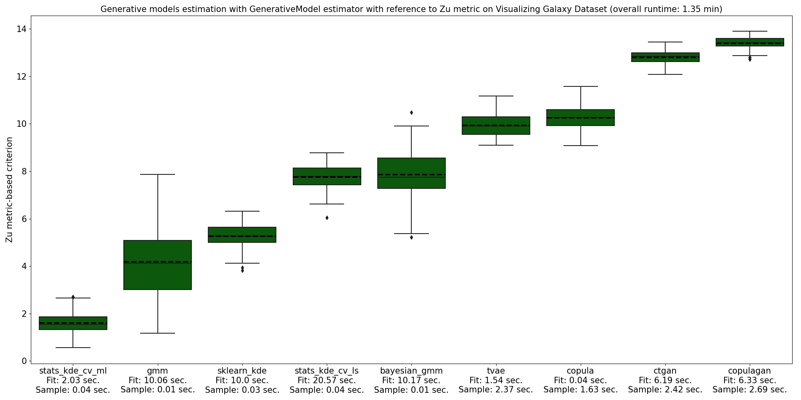
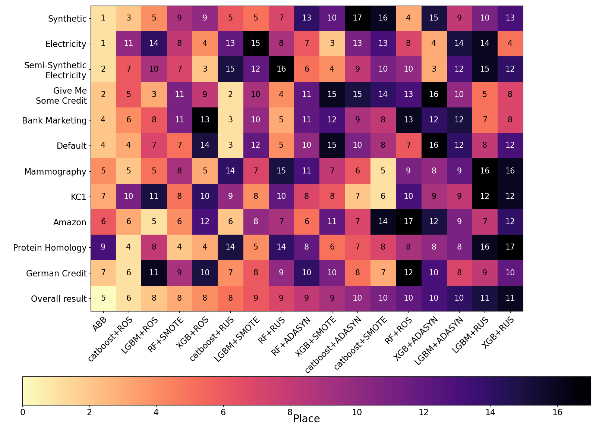

Benchmarks
================================

Small dataset problem
~~~~~~~~~~~~~~~~~~~~~~~~~~~~~~~~~~~~~

Synthetic dataset generation
~~~~~~~~~~~~~~~~~~~~~~~~~~~~~~~~~~~~~

A range of generative models were fitted on Iris Dataset using a ``GenerativeModel`` instance. The Hyperopt time parameter equaled 10 seconds and 100 synthetic samples were used to evaluate overfitting. Firstly, ``GenerativeModel`` instance was fitted with respect to Zu metric.

.. image:: img/zu_iris.png
   :width: 100%

Overall runtime took 1.13 min. The best performance was demonstrated by statsmodel's implementation of KDE with likelihood maximization. Zu metric value for this option is quite close to zero, which means that a generative model outputs similar samples and does not overfit. Deep learning models for tabular data showed worse performance as they require more time for hyper-parameters tuning and larger sample volume.

.. image:: img/c2st_iris.png
   :width: 100%

In addition to that, ``GenerativeModel`` was fitted on Iris Dataset with respect to Classifier Two-Sample Test metric. As can be seen, it takes more time to calculate this metric in comparison with Zu metric. However, it complements the overfitting analysis and allows to have a look from another perspective. According to Classifier Two-Sample Test, scikit-learn implementation of KDE outputs the best synthetic samples.

Another example of ``GenerativeModel`` estimation includes Visualizing Galaxy Dataset with respect to Zu metric. Here, the best overfitting score was obtained by statsmodel's implementation of KDE with likelihood maximization.

Using a synthetic dataset for supervised learning
~~~~~~~~~~~~~~~~~~~~~~~~~~~~~~~~~~~~~~~~~~~~~~~~~~

This example demonstrates an effect of supervised learning on synthetic dataset in case of limited sample. Full sample size of Skin Segmentation Dataset includes 80,000 instances. However, small samples were obtained from the original dataset to show the decrease in accuracy when learning on a truncated sample. After that, on each small sample KDE generation models for each class were fitted. Then a full sample of 80,000 instances was collected based on KDE synthetic datasets. Thus, we compare the accuracy obtained on a small dataset sample with the accuracy obtained on a large synthetic sample from KDE.

.. image:: img/skin.png
   :width: 100%

It could be concluded, that synthetic dataset generation allows to increase accuracy for small datasets with less than 1000 samples. Therefore, this approach should be further analysed.

Imbalanced learning
~~~~~~~~~~~~~~~~~~~~~~~~~~~~~~~~~~~~~~~~~~~~~~~~~~

Benchmarks
~~~~~~~~~~~~~~~~~~~~~~~~~~~~~~~~~~~~~~~~~~~~~~~~~~

Empirical analysis was conducted on synthetic, semi-synthetic and empirical datasets with a range of imbalance ratios. The main goal was to analyze the performance of AutoBalanceBoost and the combinations of the most popular ensemble learning algorithms with the balancing procedures that are used in ``ImbalancedLearningClassifier``. A series of experiments was run for each dataset and each competing algorithm. As a result, the mean values and confidence intervals were obtained for the test scores of the algorithms. Each dataset was split into 5 folds with 10 random seeds therefore for each baseline we ran 50 experiments and calculated the macro averaged F1-scores. Each baseline estimation time was limited by the ABB runtime. Here, ensemble algorithms were trained with the default parameters, whereas balancing procedures included hyper-parameters tuning.

.. image:: img/credit.png
   :width: 100%

In Give Me Some Credit example ABB and the combinations with random sampling algorithms demonstrate high level of accuracy.

.. image:: img/amazon.png
   :width: 100%

On Amazon Dataset almost every algorithm shows a comparable performance except for Random Forest + RandomOverSampler.

.. image:: img/elec.png
   :width: 100%

On Electricity Dataset AutoBalanceBoost significantly dominates the competition.

.. list-table:: Dataset description
   :widths: 30 13 13 19 25
   :header-rows: 1

   * - Name
     - Size
     - Features
     - Imbalance ratio
     - ABB training time, sec.
   * - Synthetic Dataset
     - 20 000
     - 6
     - 14:4:1:1
     - 242
   * - Electricity
     - 22 656
     - 8
     - 1.4:1
     - 287
   * - Semi-Synthetic Electricity
     - 22 656
     - 8
     - 10:1
     - 210
   * - Give Me Some Credit Dataset
     - 19 193
     - 10
     - 14:1
     - 167
   * - Bank Marketing
     - 4 521
     - 16
     - 7.7:1
     - 67
   * - Default of Credit Card Clients
     - 6 000
     - 23
     - 3.5:1
     - 115
   * - Mammography
     - 11 183
     - 6
     - 42:1
     - 66
   * - KC1 Software Defect Prediction
     - 2 109
     - 21
     - 5.5:1
     - 41
   * - Amazon Employee Access
     - 32 769
     - 9
     - 16:1
     - 354
   * - Protein Homology
     - 14 576
     - 74
     - 111:1
     - 613
   * - German Credit
     - 1 000
     - 20
     - 2.3:1
     - 29

In addition to that, we calculated the rank of the algorithms based on their scores. After that we averaged these ranks across the experiments. The plot below demonstrates the averaged ranks for each dataset, the place of the algorithm by the averaged rank is highlighted by the color.

As expected, among the combinations of ensembles and balancing procedures almost every type of the ensemble algorithm achieved a higher place by the average rank on some dataset, since the most effective frameworks were included into the analysis. Among balancing procedures such oversampling algorithms as SMOTE and ROS showed a better performance, although ROS is regarded as a naive strategy it proved to be quite effective. In general, with all the datasets considered ABB holds the first place with the averaged rank 4.5.

To sum up, the performance of ensemble imbalanced learning algorithms differs depending on the dataset. Therefore, to get the highest score, one should search through numerous alternatives, which is time-consuming and requires a highly qualified researcher. In this case ASID might prove very helpful. Firstly, it comprises a ``AutoBalanceBoost`` estimator, that allows to obtain models of good quality with no additional action by the researcher. Moreover, ``ImbalancedLearningClassifier`` solves the problem of searching an optimal algorithm for the required estimation time.

Imbalanced learning in industrial tasks
~~~~~~~~~~~~~~~~~~~~~~~~~~~~~~~~~~~~~~~~

This problem is based on a `public dataset <https://www.openml.org/d/1504>`_ and consists in steel plates fault detection. Automation of fault detection allows to improve the production quality and reduce testing costs. The complexity of this dataset lies in that there is a class imbalance between different types of faults. The sample consists of 1941 instances. Predictors represent 27 features that describe the fault geometry.

.. image:: img/steel.png
   :width: 100%

The class labels indicate the fault type. There are 7 classes with the largest imbalance of 1:12: bumps, K_scratches, Z_scratches, pastry, stains, dirtiness and other faults type.

.. image:: img/types.png
   :width: 100%

Due to the large imbalance this problem could be solved using ``ImbalancedLearningClassifier`` to fit an optimal model. Algorithm run took 29 minutes and 15 seconds. As a result the algorithm output classification scores on 15 dataset splits.

.. image:: img/steel_res.png
   :width: 100%

As can bee seen, the optimal model includes ADASYN balancing procedure and XGBoost classifier. The mean F-score averaged by classes for optimal model is 0.82, which states a good quality of the resulting model. We also checked an out-of-fold score on a 20% test sample for the optimal model and obtained the following report. It can be concluded that classification score varies from 0.57 to 0.97 depending on a fault type.

.. image:: img/scores.png
   :width: 100%

